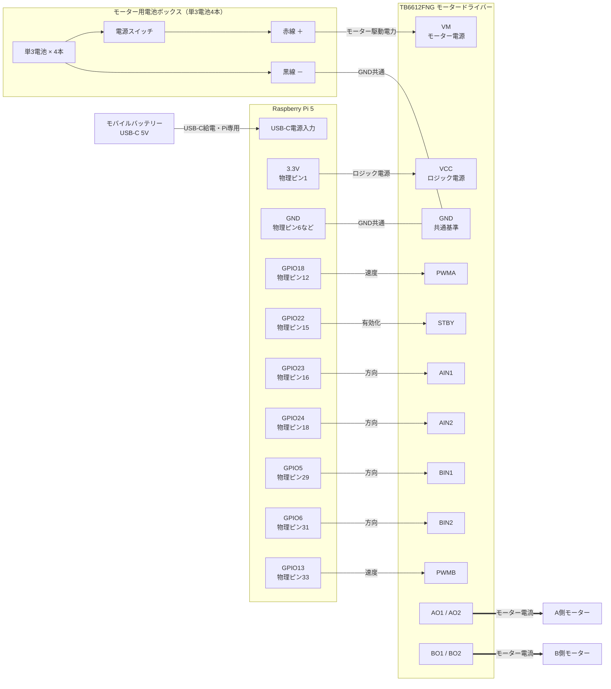

# Phase1 Wiring

Buddyで使用しているRaspberry Pi 5、TB6612FNGデュアルモータードライバー、2WDシャーシの確定配線。

この文書では、`GPIO18`などをBCM GPIO番号、`物理ピン12`などをRaspberry Piの40ピンコネクター上の位置として表記する。

## 電源構成

Raspberry Piとモーターは別々の電源を使用する。

| 電源・端子 | 接続先 | 役割 |
| --- | --- | --- |
| Raspberry Pi USB-C | Raspberry Pi | Pi本体の電源 |
| Raspberry Pi 3.3V | TB6612FNG `VCC` | ドライバーのロジック電源 |
| モーター用電池 `+` | TB6612FNG `VM` | モーター駆動電源 |
| モーター用電池 `-` | TB6612FNG `GND` | モーター電源の基準 |
| Raspberry Pi `GND` | TB6612FNG `GND` | GPIO信号の共通基準 |

重要:

- Raspberry Piの5Vまたは3.3V端子からモーターへ給電しない。
- モーター用電池からRaspberry Piへ給電しない。
- Raspberry Pi、TB6612FNG、モーター用電池のGNDは共通にする。
- TB6612FNGの`VCC`と`VM`を取り違えない。

## 全体配線図



図の読み方:

- Raspberry PiからTB6612FNGへ向かうGPIO線は制御信号。
- 電池ボックスの赤線を`VM`、黒線を`GND`へ接続する。
- 電池ボックスのスイッチはモーター電源だけをON/OFFする。
- `AO1/AO2`と`BO1/BO2`だけがモーターへ大きな電流を流す。
- Raspberry Pi用電源とモーター用電源は分離するが、GNDは共通にする。
- A側・B側のどちらが車体の物理的な左右に接続されているかは、現在の実機配線を維持する。

## 電池ボックス配線

| 電池ボックス | TB6612FNG | 意味 |
| --- | --- | --- |
| 赤線 `+` | `VM` | モーター駆動用のプラス電源 |
| 黒線 `-` | `GND` | モーター電源のマイナス |

電池ボックスの黒線を接続したTB6612FNGの`GND`には、Raspberry Piの`GND`も接続する。これにより、別電源のままGPIO信号の基準だけを共通にできる。

```text
電池ボックス赤線（＋） ───────→ TB6612FNG VM
電池ボックス黒線（－） ──┬────→ TB6612FNG GND
                          └────→ Raspberry Pi GND
```

注意:

- 赤線を`VCC`へ接続しない。
- 黒線をRaspberry Piの3.3Vまたは5Vへ接続しない。
- 電池ボックスからRaspberry Pi本体へ給電しない。
- 配線作業中は電池ボックスのスイッチをOFFにする。

## 確定GPIO配線

現在のコード`robot/pins.py`と一致する配線。

| TB6612FNG | BCM GPIO | 物理ピン | 役割 |
| --- | ---: | ---: | --- |
| `PWMA` | GPIO18 | 12 | 左モーターのPWM |
| `AIN1` | GPIO23 | 16 | 左モーターの方向信号1 |
| `AIN2` | GPIO24 | 18 | 左モーターの方向信号2 |
| `PWMB` | GPIO13 | 33 | 右モーターのPWM |
| `BIN1` | GPIO5 | 29 | 右モーターの方向信号1 |
| `BIN2` | GPIO6 | 31 | 右モーターの方向信号2 |
| `STBY` | GPIO22 | 15 | ドライバーの有効化 |

BCM番号と物理ピン番号は異なる。例えば`GPIO5`は物理ピン29であり、物理ピン5ではない。

## Raspberry Pi側の使用ピン

```text
物理ピン  1: 3.3V  → TB6612FNG VCC
物理ピン 12: GPIO18 → PWMA
物理ピン 15: GPIO22 → STBY
物理ピン 16: GPIO23 → AIN1
物理ピン 18: GPIO24 → AIN2
物理ピン 29: GPIO5  → BIN1
物理ピン 31: GPIO6  → BIN2
物理ピン 33: GPIO13 → PWMB
GNDピンのいずれか → TB6612FNG GND
```

GNDには物理ピン`6`、`9`、`14`、`20`、`25`、`30`、`34`、`39`のいずれかを使用できる。既に使用中の場合はブレッドボードなどで分岐して共通化する。

## モーター出力

| TB6612FNG | 接続先 |
| --- | --- |
| `AO1` / `A01` | A側モーターの線1 |
| `AO2` / `A02` | A側モーターの線2 |
| `BO1` / `B01` | B側モーターの線1 |
| `BO2` / `B02` | B側モーターの線2 |

Buddyでは前進、後退、左旋回、右旋回を実機で確認済み。モーター線を入れ替えると回転方向が反転するため、現在の配線を理由なく変更しない。

## 信号の役割

### AIN1・AIN2 / BIN1・BIN2

各モーターへ流す電流の向きを決める。

| IN1 | IN2 | 動作 |
| ---: | ---: | --- |
| HIGH | LOW | 一方向へ回転 |
| LOW | HIGH | 反対方向へ回転 |
| LOW | LOW | 出力停止 |

実際の正転・逆転方向は、モーター線の接続方向で決まる。

### PWMA / PWMB

高速なON/OFFを行うPWM信号。コードでは`0.0`から`1.0`の値で出力を指定する。

```text
0.0 = 出力0%
0.5 = 出力50%
1.0 = 出力100%
```

Buddyのモーターは低出力では静止摩擦やギア抵抗に負けて回らない場合がある。

### STBY

TB6612FNG全体を有効または無効にする。

```text
HIGH = モーター制御を有効化
LOW  = モーター制御を無効化
```

プログラム終了時は`STBY`をLOWにしてGPIOを解放する。

## 距離センサー追加用の予約ピン

KP-VL53L1X距離センサーではI2C用ピンを使用する。現在のモーター配線とは競合しない。

| 距離センサー | BCM GPIO | 物理ピン |
| --- | ---: | ---: |
| `SDA` | GPIO2 | 3 |
| `SCL` | GPIO3 | 5 |
| `VDD` | 3.3V | 1または17 |
| `GND` | GND | 利用可能なGNDピン |

`GPIO5`と物理ピン5は別物なので注意する。モーターの`BIN1`はGPIO5・物理ピン29、距離センサーの`SCL`はGPIO3・物理ピン5を使う。

## 通電前チェックリスト

- [ ] モーター用電池のスイッチがOFF
- [ ] Raspberry Piとモーターの電源が分離されている
- [ ] Raspberry Piの5V端子が`VM`へ接続されていない
- [ ] モーター用電池がRaspberry Piへ接続されていない
- [ ] TB6612FNGの`VCC`がRaspberry Piの3.3Vへ接続されている
- [ ] TB6612FNGの`VM`がモーター用電池のプラスへ接続されている
- [ ] Raspberry Pi、TB6612FNG、モーター用電池のGNDが共通
- [ ] GPIO配線が確定GPIO表と一致している
- [ ] モーターがA・B出力へ確実に接続されている
- [ ] 裸線やジャンパーワイヤーが隣の端子へ触れていない
- [ ] 最初のテストでは車輪を床から浮かせている

## 実機確認コマンド

車輪を床から浮かせて、1秒間だけ実行する。

```sh
python3 -m robot.motor_cli forward \
  --backend gpiozero \
  --speed 1 \
  --max-speed 1 \
  --duration 1
```

詳細なコマンド一覧は`docs/commands.md`を参照する。
